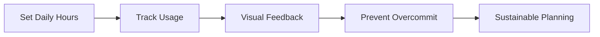
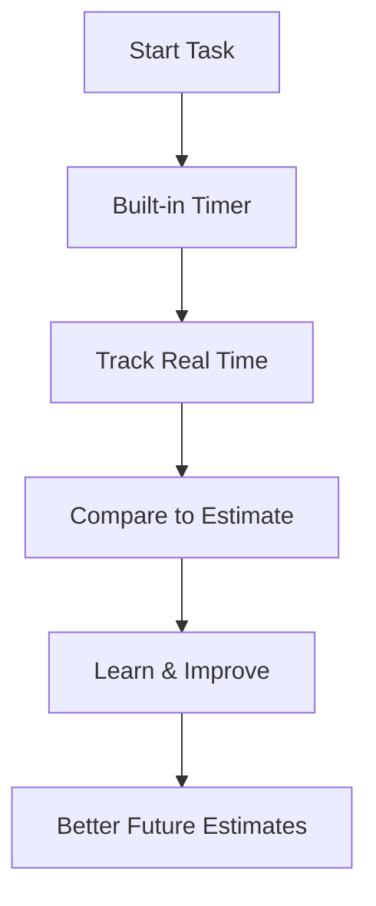
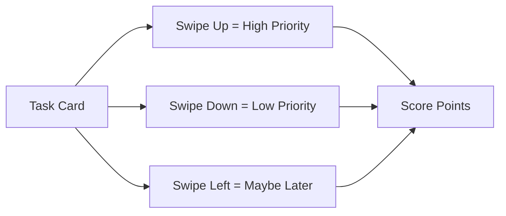
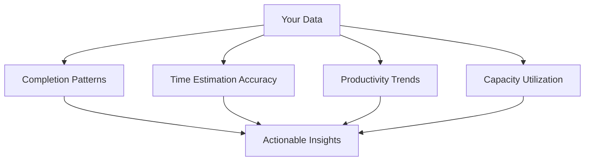
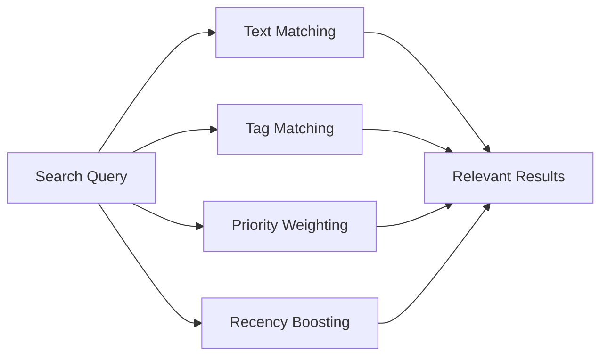
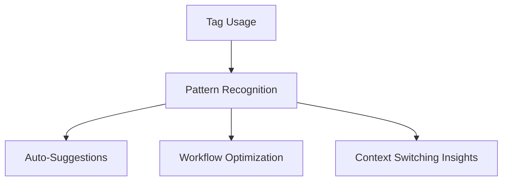
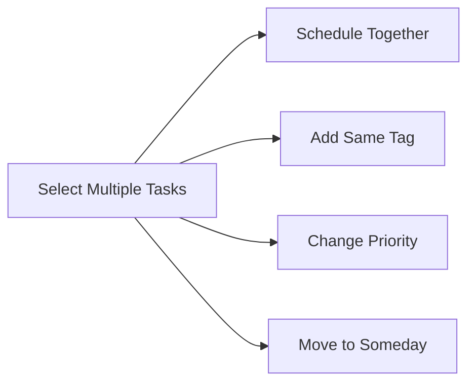
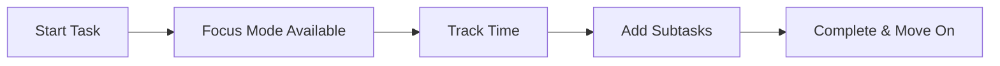
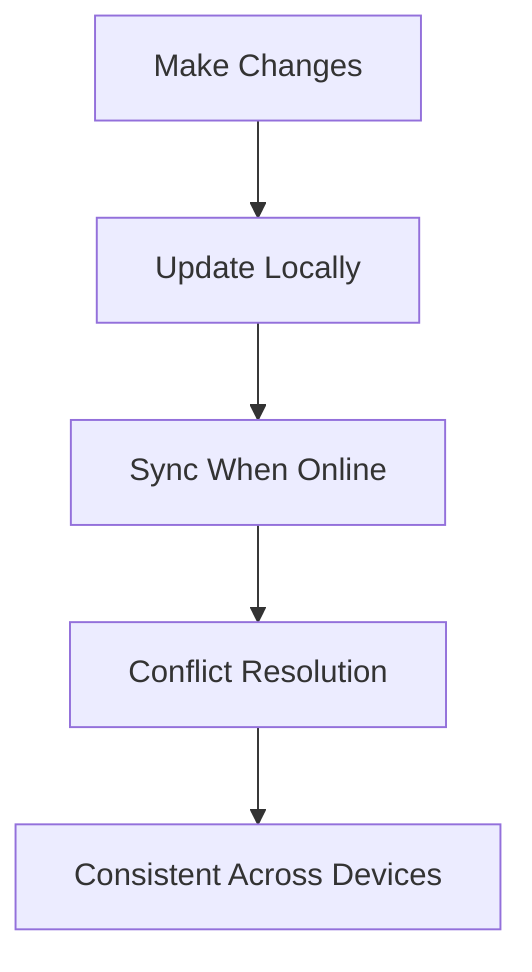

# Core Features Walkthrough: The Complete RightNow Experience

Let's take a deep dive into what makes RightNow different. This isn't just another feature list - it's a guided tour through the philosophy and functionality that makes capacity-first planning work.

## 🎯 The Capacity System: Your North Star

The capacity bar isn't just visual decoration - it's the core constraint that makes everything else work.

### How It Works

1. **Set Your Reality**: Start with your actual available hours (not wishful thinking)
2. **Real-Time Tracking**: See capacity fill up as you add tasks
3. **Visual Warnings**: Red zones when you're approaching limits
4. **Smart Suggestions**: "You have 2 hours left - perfect for these tasks"

### The Psychology Behind It

Traditional apps let you add infinite tasks. RightNow says "Hold on - you only have 6 hours today. Choose wisely." This constraint forces better decision-making.

**Example Day:**
- 8 hours at work
- 2 hours for meetings/breaks
- **6 hours capacity** for focused work
- Tasks must fit within this reality

## ⏱️ Time Tracking That Actually Helps

Most time tracking feels like surveillance. Ours feels like learning.

### Key Features

- **One-Tap Start**: No complex setup, just hit play
- **Automatic Learning**: App improves estimates based on your patterns
- **Flexible Tracking**: Pause, resume, or adjust as needed
- **Privacy First**: All data stays on your device

### What Users Discover

*"I thought emails took 5 minutes. They actually take 20 minutes on average."*

*"My most productive hours are 10am-12pm, not after lunch like I thought."*

*"Writing takes 3x longer than I estimate, but coding is pretty accurate."*

## 🎮 Task Grooming Games: Making Planning Fun

The most unique feature in RightNow - gamified task management that people actually enjoy.

### The Priority Game

**How It Works:**
- Swipe up for high priority tasks
- Swipe down for low priority  
- Swipe left for "maybe later"
- Build streaks for consistent grooming

### The Duration Game

Quick time estimation made fun:

- **Swipe Right**: "This will take longer than expected"
- **Swipe Left**: "This is quicker than it looks"
- **Swipe Up**: "Perfect estimate as-is"

### The Clarity Game

Improve task descriptions through interaction:

- Rate task clarity (1-5 stars)
- Add missing details
- Break down vague tasks
- Score points for improvements

### Why Games Work

1. **Removes Friction**: Fun beats tedious
2. **Builds Habits**: Streaks encourage consistency
3. **Reduces Overwhelm**: One task at a time
4. **Provides Closure**: Clear completion signals

## 📊 Analytics That Drive Action

Data without insight is just noise. RightNow's analytics tell you what to do next.

### The Dashboard

### Key Metrics

**Completion Rate**: How often you finish what you plan
- Target: 80% (not 100% - that's perfectionism)
- Insight: "Your Tuesday completion rate is 65% - consider lighter scheduling"

**Estimation Accuracy**: How close your estimates are to reality
- Target: Within 20% of actual time
- Insight: "You underestimate writing tasks by 40% on average"

**Capacity Utilization**: How much of your available time you actually use
- Target: 70-80% (buffer for unexpected tasks)
- Insight: "You're using 95% capacity - consider reducing by 1 hour"

**Peak Performance Times**: When you're most productive
- Insight: "You complete 60% more tasks between 9-11am"

### Personalized Recommendations

- "Schedule important tasks for Tuesday mornings"
- "Add 15 minutes to your writing estimates"
- "Consider reducing capacity from 7 to 6 hours"
- "You haven't groomed tasks in 3 days - quick session?"

## 🔍 Smart Search & Filtering

Find what you need without thinking about it.

### Search That Understands Context

**Examples:**
- "email" → finds tasks with "email" in title or description
- "#urgent" → finds all urgent-tagged tasks
- "project meeting" → finds tasks with both words, prioritizes recent ones

### Advanced Filters

**By Status:**
- Scheduled for today
- Unscheduled backlog
- Completed tasks
- In progress

**By Time:**
- Duration range (e.g., 30-60 minutes)
- Created this week
- Due soon
- Overdue

**By Context:**
- Specific tags
- Priority levels
- Estimated energy needed
- Location context

### Saved Filter Combinations

Create custom views for different contexts:

- "Morning Deep Work" → High priority, 60+ minutes, #focus tag
- "Quick Wins" → Low priority, <30 minutes, any tag
- "Client Work" → #client tag, sorted by deadline
- "Personal Projects" → #personal tag, sorted by interest

## 🏷️ Tagging System That Scales

Simple enough for beginners, powerful enough for power users.

### Tag Categories

**Context Tags**: Where/when you do work
- `@office`, `@home`, `@commute`
- `#morning`, `#afternoon`, `#evening`

**Project Tags**: What you're working on
- `#website-redesign`, `#quarterly-report`
- `#personal-project`, `#side-hustle`

**Energy Tags**: Mental state required
- `#deep-work`, `#creative`, `#administrative`
- `#high-energy`, `#low-energy`

**Priority Tags**: Urgency and importance
- `#urgent`, `#important`, `#someday`
- `#client-work`, `#internal`

### Tag Intelligence

The app learns from your tagging patterns:

**Smart Suggestions:**
- "Tasks tagged #writing usually take 45 minutes"
- "You're most productive with #creative tasks at 10am"
- "Consider batching #administrative tasks on Fridays"

## 🗓️ Flexible Scheduling

Move tasks between days without losing context.

### Scheduling Options

**Today**: High-priority, time-blocked tasks
**Tomorrow**: Next-day planning
**This Week**: Flexible scheduling within 7 days
**Someday**: Backlog for future consideration

### Bulk Operations

**Common Workflows:**
- End of day: Move incomplete tasks to tomorrow
- Weekly planning: Schedule next week's priorities
- Context switching: Batch similar tasks together
- Capacity management: Move tasks when overbooked

## 🎯 Focus Mode: Deep Work Support

When you're ready to work, RightNow gets out of the way.

### Full-Screen Active Task

- **Minimalist interface**: Just the task and timer
- **Subtask support**: Break down current work
- **Distraction-free**: No notifications or other tasks visible
- **Quick notes**: Capture thoughts without losing focus

### Active Task Management

**Subtask Features:**
- Simple checkboxes for micro-tasks
- Stored in task description (no database bloat)
- Reorderable for workflow optimization
- Progress tracking for complex tasks

## 🔄 Cross-Platform Sync

Your tasks follow you everywhere.

### Offline-First Design

### Platform Support

- **Android**: Full native experience
- **iOS**: Coming soon
- **Web**: Full functionality at rightnow01.web.app
- **Desktop**: Windows, Mac, Linux support

### Sync Intelligence

- **Conflict resolution**: Newest timestamp wins
- **Bandwidth optimization**: Only sync changes
- **Offline indication**: Clear online/offline status
- **Manual sync**: Force sync when needed

## 🎛️ Customization Options

Make RightNow work for your unique workflow.

### Capacity Settings

- **Daily hours**: Your realistic availability
- **Buffer time**: Padding for unexpected tasks
- **Working days**: Customize your work week
- **Break intervals**: Built-in rest periods

### Interface Preferences

- **Theme**: Light/dark mode support
- **Notifications**: Configurable reminders
- **Time format**: 12h or 24h display
- **First day of week**: Cultural preferences

### Advanced Settings

- **Estimation algorithm**: Conservative vs. optimistic
- **Grooming reminders**: Frequency and timing
- **Analytics privacy**: What data to track
- **Export options**: Get your data out anytime

## 🔮 What's Coming Next

RightNow is actively developed with user feedback driving features:

- **Team collaboration**: Shared capacity planning
- **Calendar integration**: Two-way sync with Google/Outlook
- **AI insights**: Smarter pattern recognition
- **Habit tracking**: Build consistent routines
- **API access**: Integrate with other tools

## Making It Work for You

Every feature in RightNow is designed around one principle: **sustainable productivity**. Not doing more, but doing the right things within your actual capacity.

The magic happens when all these features work together:
1. **Capacity** keeps you realistic
2. **Time tracking** builds awareness
3. **Grooming games** maintain your backlog
4. **Analytics** guide improvements
5. **Scheduling** manages your time
6. **Focus mode** supports deep work

Ready to experience it yourself? Try RightNow and discover what realistic planning feels like.

📱 **Try RightNow Today:**
- [Main App Page](/rightnow/)
- [Privacy Policy](/rightnow-privacy-policy/)
- [Delete Account](/rightnow-delete-account/)

---

*Previous: [Introduction to RightNow ←](/blog/introduction-to-rightnow) | Next: [Development Journey & Changelog →](/blog/development-journey-changelog)*