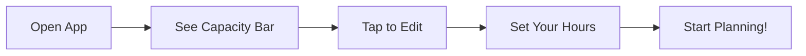
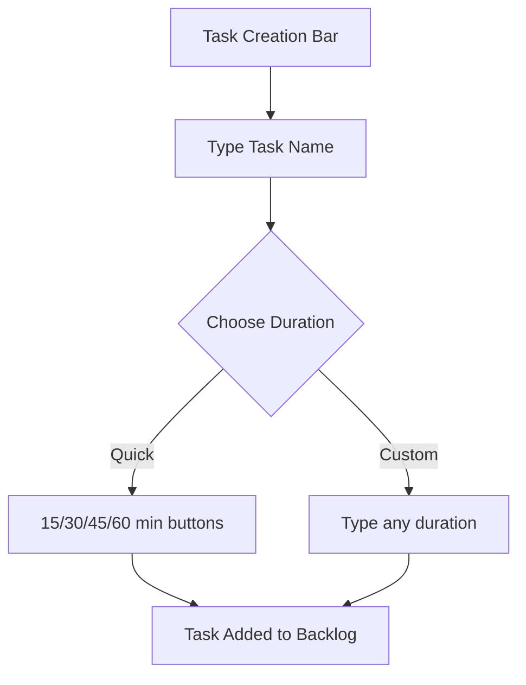
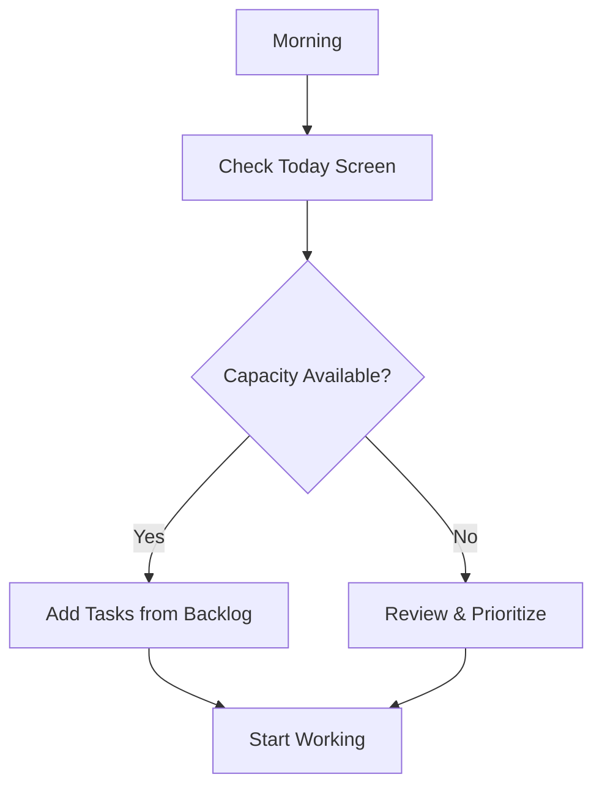

# Getting Started with RightNow: Your First Day

Welcome! This guide will walk you through your first day with RightNow, helping you set up a sustainable productivity system that actually works. Let's dive in!

## First Launch: Setting Your Daily Capacity

When you first open RightNow, you'll see a capacity bar at the top of the Today screen. This is the heart of the app - your daily time budget.

### How to Set Your Capacity

1. **Tap the capacity bar** at the top of the screen
2. **Enter your available hours** (we recommend starting with 6 hours)
3. **Hit save** - you're ready to go!

💡 **Pro Tip**: Be realistic! If you have 8 hours at work, you probably have 5-6 hours of actual productive time after meetings, breaks, and interruptions.

## Creating Your First Tasks

Now let's add some tasks. RightNow makes this super simple:

1. **Tap the task creation bar** at the bottom
2. **Type your task** (e.g., "Review project proposal")
3. **Set a duration** using the quick buttons (15m, 30m, 45m, 1h)
4. **Hit enter** - your task is created!

## Understanding the Three Screens

RightNow has three main areas:

### 📅 Today Screen
Your command center for the current day:
- Shows only tasks scheduled for today
- Displays your capacity usage
- Allows drag-and-drop reordering
- Features the time tracking controls

### 📋 All Tasks Screen
Your complete task backlog:
- Shows all unscheduled tasks
- Allows bulk scheduling to today
- Supports advanced filtering and search
- Perfect for weekly planning sessions

### ⚙️ Settings Screen
Customize your experience:
- Adjust daily capacity
- Manage tags and filters
- View analytics
- Configure app preferences

## Your First Workflow

Here's a simple workflow to get you started:

### Morning Planning (5 minutes)
1. Open RightNow
2. Review what's already scheduled for today
3. Check your capacity bar
4. Add 2-3 important tasks from All Tasks
5. Start your first task!

### During the Day
- **Start tracking** when you begin a task (tap the play button)
- **Stop tracking** when you finish or take a break
- **Complete tasks** with a satisfying swipe
- **Reschedule** if plans change

### End of Day Review (3 minutes)
1. Complete or reschedule remaining tasks
2. Celebrate what you accomplished!
3. Quick look at tomorrow's capacity

## Power User Tips

### 🏷️ Use Tags Effectively
- Create tags for contexts (@office, @home)
- Tag by project or client
- Use tags for energy levels (#deep-work, #quick-wins)

### ⏰ Time Tracking Best Practices
- Always track actual time, not just estimates
- Use the timer to build awareness
- Let the app learn from your patterns

### 🎯 The 80% Rule
- Only schedule to 80% capacity
- Leave buffer for unexpected tasks
- Reduces stress and increases completion rate

## Common Beginner Mistakes to Avoid

### ❌ Over-scheduling
**Mistake**: Filling your entire 8-hour capacity  
**Fix**: Start with 6 hours and adjust based on experience

### ❌ Vague Task Names
**Mistake**: "Work on project"  
**Fix**: "Draft introduction section of project proposal"

### ❌ Ignoring Time Tracking
**Mistake**: Never using the timer  
**Fix**: Track at least 3 tasks per day to improve estimates

### ❌ The Everything Bucket
**Mistake**: Adding every tiny task  
**Fix**: Batch small tasks or use subtasks for micro-items

## Your First Week Challenge

Try this progression over your first week:

1. **Day 1**: Add 5 tasks, complete 3
2. **Day 2**: Use time tracking on 2 tasks
3. **Day 3**: Try the task grooming games
4. **Day 4**: Create and use 3 tags
5. **Day 5**: Review your analytics
6. **Weekend**: Plan next week using insights

## Troubleshooting

### "I keep exceeding my capacity!"
- Reduce your daily capacity by 1 hour
- Break large tasks into smaller chunks
- Be more realistic with estimates

### "I never know how long tasks will take"
- Start with the app's suggestions
- Always use the timer
- Review analytics weekly

### "Too many tasks in my backlog!"
- Use the grooming games weekly
- Archive tasks you won't do
- Focus on this week only

## Next Steps

Now that you're up and running:

1. **Explore task grooming** - Make it a Friday ritual
2. **Check analytics** - Learn from your patterns  
3. **Customize settings** - Make it yours
4. **Share feedback** - We're building this together!

Welcome to a more realistic, sustainable way of working. Welcome to RightNow!

📱 **Get Started:**
- [RightNow App Development](/rightnow/)
- [Privacy Policy](/rightnow-privacy-policy/)
- [Delete Account](/rightnow-delete-account/)

---

*Previous: [Development Journey & Changelog ←](/blog/development-journey-changelog) | Next: [Core Features Deep Dive →](/blog/core-features-walkthrough)*