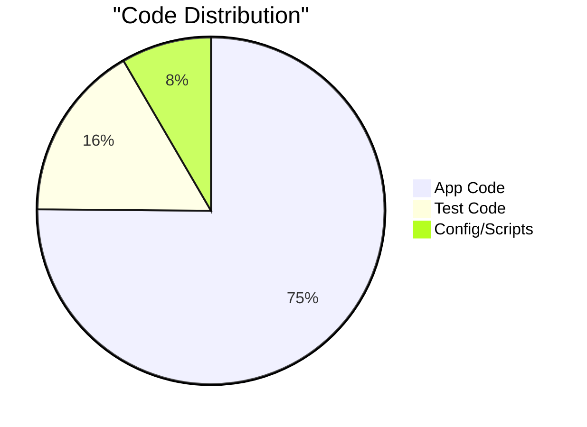
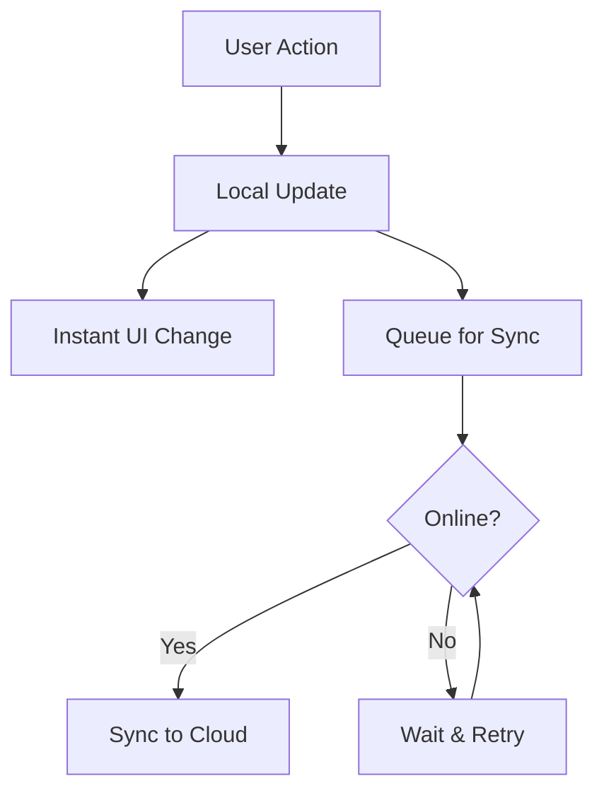
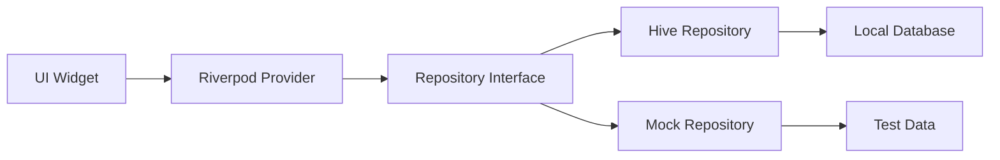
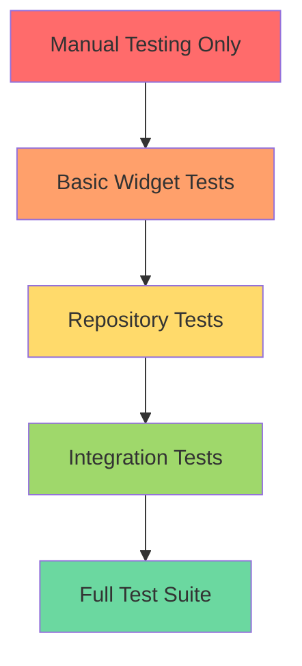
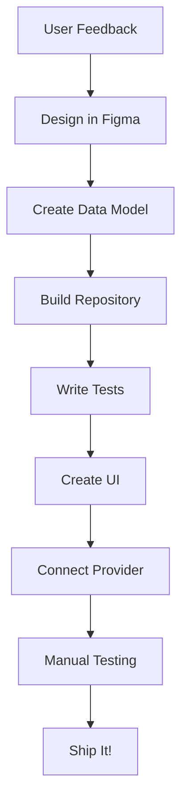
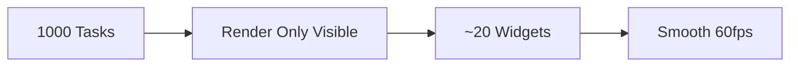
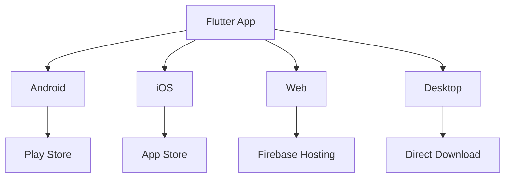
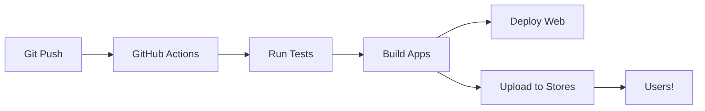

# RightNow Technical Deep Dive: Building in Public

As an indie developer building RightNow in public, I want to share the technical journey and decisions behind the app. This isn't about showing off code - it's about sharing what I've learned and helping others who might be on a similar path.

## The Numbers: A Growing Codebase

Let's start with some stats that show the scale of this project:

- **44,724 lines** of Dart code in the app
- **9,798 lines** of test code  
- **41 test files** with 258 tests passing
- **9 major milestones** completed
- **6 months** of active development



## Architecture: Why Offline-First?

Early on, I made a crucial decision: **offline-first architecture**. Here's why:



### Benefits I've Experienced

1. **Lightning fast UI** - No waiting for network calls
2. **Works anywhere** - Airplane, subway, poor connection
3. **No loading spinners** - Everything feels instant
4. **Reliability** - Network issues don't break the app

### The Trade-offs

- More complex sync logic
- Potential for conflicts (solved with timestamps)
- Larger app size (local database)
- Testing is more involved

## State Management Evolution

I went through several iterations before landing on the current architecture:

### Version 1: Simple Provider
```
Widget → Provider → Database
```
**Problem**: Too much rebuilding, poor performance

### Version 2: Repository Pattern
```
Widget → Provider → Repository → Database
```
**Better**: Separation of concerns, easier testing

### Version 3: Current Architecture


This pattern has been a game-changer for:
- **Testing** - Swap real/mock repositories easily
- **Features** - Add new data sources without touching UI
- **Debugging** - Clear separation of layers

## The Testing Journey

Testing wasn't an afterthought - it evolved with the app:



### Current Test Coverage

- **Unit Tests**: Repository logic, data models
- **Widget Tests**: UI components in isolation  
- **Integration Tests**: Full user workflows
- **Manual Tests**: Real device testing

### Testing Lessons Learned

1. **Start simple** - Even basic tests catch bugs
2. **Mock at boundaries** - Repository interfaces are perfect
3. **Test user journeys** - Not just individual functions
4. **Keep tests fast** - Or you won't run them

## Feature Development Process

Here's how I typically build a new feature:



### Real Example: Task Grooming Games

The gamification feature went through this exact process:

1. **Feedback**: "Grooming backlog is boring"
2. **Design**: Swipe-based card games
3. **Model**: GroomingData with score tracking
4. **Repository**: Separate from main task repo
5. **Tests**: Swipe gesture handling
6. **UI**: Custom game widgets
7. **Provider**: Game state management
8. **Testing**: Friends loved it!
9. **Shipped**: In 3 days

## Performance Optimizations

Building for mobile taught me about performance the hard way:

### Problem 1: Slow List Scrolling
**Solution**: Implemented virtualization


### Problem 2: Expensive Rebuilds
**Solution**: Selective watching with Riverpod
```dart
// Instead of watching entire task list
ref.watch(taskListProvider.select((tasks) => tasks.length))
```

### Problem 3: Memory Leaks
**Solution**: Proper disposal and lifecycle management

## Platform Challenges

Supporting multiple platforms brought unique challenges:



### Platform-Specific Issues

- **Android**: Keyboard handling, back button
- **iOS**: Safe areas, gesture conflicts  
- **Web**: Browser back button, local storage limits
- **Desktop**: Window management, file system

## Key Technical Decisions

### ✅ Decisions I'm Happy With

1. **Flutter** - Write once, run everywhere actually works
2. **Offline-first** - Users love the speed
3. **Hive database** - Simple, fast, reliable
4. **Repository pattern** - Made everything testable
5. **Riverpod** - Powerful state management

### 🤔 Decisions I'd Reconsider

1. **Not using code generation earlier** - Would have saved time
2. **Custom animation system** - Should have used built-in
3. **Over-engineering early** - YAGNI is real
4. **Delaying tests** - Should have started day one

## Deployment Pipeline

Getting the app to users efficiently:



But when GitHub Actions minutes ran out, I adapted:

```batch
:: Local build script
flutter test
flutter build web
firebase deploy
flutter build appbundle
fastlane upload
```

## Lessons for Other Indie Developers

### 1. Start Shipping Early
Don't wait for perfection. My first version had 5 features, not 50.

### 2. Listen to Users
The best features came from user feedback, not my ideas.

### 3. Automate Everything
Time spent on automation pays back 10x.

### 4. Test the Critical Path
You don't need 100% coverage, just test what matters.

### 5. Document as You Go
This blog post was easier because I kept notes.

## What's Next?

The technical journey continues:

- **Real-time sync** - WebSocket integration
- **Collaborative features** - Shared task lists
- **AI integration** - Smart task suggestions
- **Plugin system** - Let users extend functionality

## Open Source Plans

I'm considering open-sourcing parts of RightNow:

- The task grooming game engine
- The offline-first sync system  
- The capacity management algorithm
- Testing utilities I've built

## Join the Journey

Building in public means sharing the good and the bad. Follow along:

- 📱 Try the app: [rightnow01.web.app](https://rightnow01.web.app)
- 📖 Learn more: [RightNow App Development](/rightnow/)
- 📝 Blog series: [All RightNow posts](/blog/)

Have questions? Want to share your experience? I'd love to hear from you!

---

*Previous: [Target Audience & Use Cases ←](/blog/target-audience-use-cases) | Next: [Introduction to RightNow →](/blog/introduction-to-rightnow)*

---

*Learn more: [RightNow App Development](/rightnow/) | [Privacy Policy](/rightnow-privacy-policy/) | [Delete Account](/rightnow-delete-account/)*