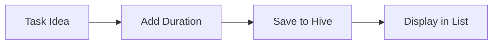
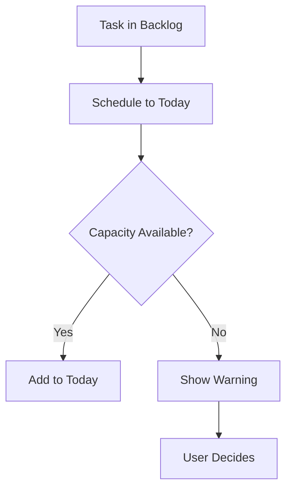
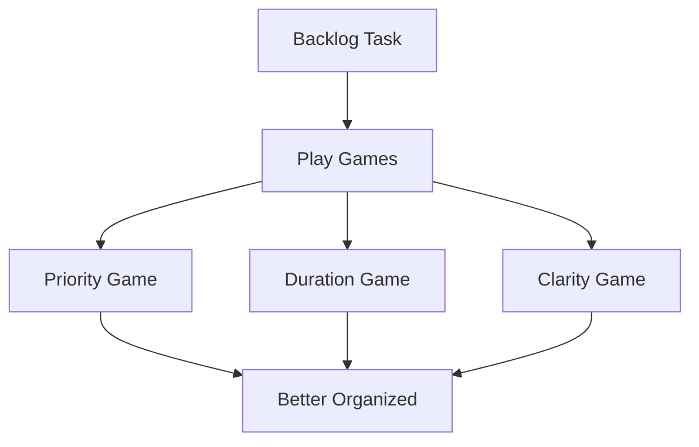
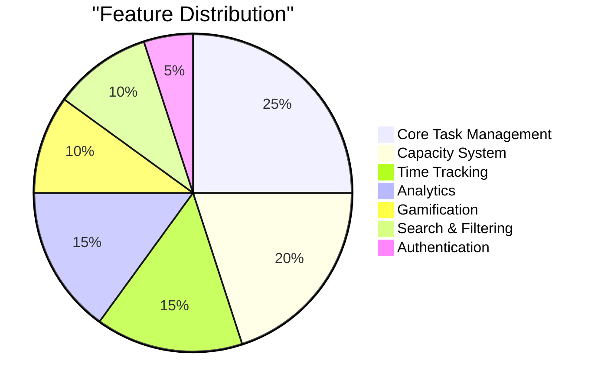
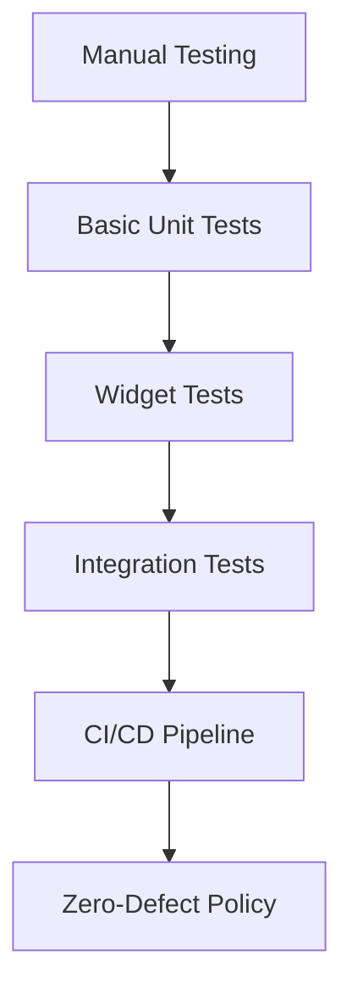

# Building RightNow: Development Journey & Progress Chronicle

Building RightNow has been an incredible journey of learning, iteration, and growth. This post chronicles the major milestones, challenges overcome, and lessons learned while developing a capacity-first productivity app from scratch.

## The Genesis: Why Another To-Do App?

**March 2024**: The idea struck during a particularly frustrating day where I'd planned 12 hours of work for an 8-hour day. I was tired of productivity apps that enabled my unrealistic planning instead of helping me be more honest about time.

**The Core Insight**: What if an app actively prevented overcommitment instead of just organizing it?

## Development Milestones: From Concept to Launch

### 🚀 Milestone 1: Core Task Management (April 2024)

**Status: COMPLETE** | **Duration: 3 weeks**

The foundation had to be solid. I started with basic CRUD operations but with a twist - every task needed a duration from day one.

**Key Achievements:**
- ✅ Task model with duration as required field
- ✅ Hive database integration for offline-first storage
- ✅ Repository pattern for clean data access
- ✅ Basic task list UI with Material Design 3

**Technical Challenge**: Designing a data model that could evolve. The task model grew from 5 fields to 15+ as features developed.

**User Feedback**: "Finally, a to-do app that makes me think about time!"

### ⚡ Milestone 2: Capacity Management System (May 2024)

**Status: COMPLETE** | **Duration: 2 weeks**

The heart of the app - the capacity constraint that makes everything else work.

**Key Achievements:**
- ✅ Daily capacity setting with visual progress bar
- ✅ Real-time capacity validation
- ✅ Overflow warnings with override options
- ✅ Duration preset buttons (15m, 30m, 45m, 1h)

**Technical Challenge**: Making capacity calculations reactive across the entire app. Every task change needs to trigger capacity recalculation.

**Breakthrough Moment**: Adding the red "over capacity" warning. Users immediately understood the concept.

**User Feedback**: "This is the first app that tells me to stop adding tasks!"

### 📅 Milestone 3: Task Scheduling (May 2024)

**Status: COMPLETE** | **Duration: 2 weeks**

Moving from backlog to daily execution with capacity awareness.

**Key Achievements:**
- ✅ Schedule tasks from All Tasks to Today
- ✅ Visual indicators (TODAY, TOMORROW, specific dates)
- ✅ Capacity-aware scheduling with warnings
- ✅ Bulk scheduling operations

**Technical Challenge**: Maintaining consistency between scheduled and unscheduled states while keeping UI responsive.

**Design Evolution**: Started with date pickers, moved to quick action buttons based on user feedback.

### 🎯 Milestone 4: Today Screen Features (June 2024)

**Status: COMPLETE** | **Duration: 3 weeks**

Transforming the Today screen from a simple list to a productivity command center.

**Key Achievements:**
- ✅ Drag-and-drop task reordering
- ✅ Integrated time tracking with start/stop
- ✅ Active task banner with real-time timer
- ✅ Task completion workflows

**Technical Challenge**: Implementing smooth drag-and-drop while maintaining time tracking state.

**User Delight**: The satisfying task completion animation became a favorite feature.

**User Feedback**: "I love reordering tasks as my priorities shift throughout the day."

### 🔍 Milestone 5: Search, Filtering & Tagging (July 2024)

**Status: COMPLETE** | **Duration: 4 weeks**

Making large task lists manageable through intelligent organization.

**Key Achievements:**
- ✅ Fuzzy search with relevance scoring
- ✅ Comprehensive filtering system
- ✅ Smart sorting algorithms
- ✅ Full tag system with color coding
- ✅ Saved filter combinations

**Technical Challenge**: Balancing search performance with rich filtering options. Had to implement custom indexing for fast results.

**Surprise Discovery**: Users created their own tagging conventions faster than expected. The system needed to be flexible enough to support diverse workflows.

**User Feedback**: "The search actually finds what I'm looking for, even with typos."

### 📊 Milestone 6: Analytics & Intelligence (August 2024)

**Status: COMPLETE** | **Duration: 3 weeks**

Turning data into actionable insights for better planning.

**Key Achievements:**
- ✅ Completion pattern analysis
- ✅ Time estimation accuracy tracking
- ✅ Productivity trend visualization
- ✅ Personalized recommendations
- ✅ Smart insights dashboard

**Technical Challenge**: Creating meaningful analytics without overwhelming users. The key was actionable insights, not just pretty charts.

**Breakthrough**: The "estimation accuracy" metric became a game-changer. Users started seeing their blind spots.

**User Feedback**: "I had no idea I was terrible at estimating writing tasks!"

### 🎮 Milestone 7: Gamified Grooming System (September 2024)

**Status: COMPLETE** | **Duration: 4 weeks**

Making backlog maintenance fun instead of tedious.

**Key Achievements:**
- ✅ Priority Game with swipe gestures
- ✅ Duration Game for time estimation
- ✅ Clarity Game for task refinement
- ✅ Streak tracking and achievements
- ✅ Mixed mode with intelligent game selection

**Technical Challenge**: Designing game mechanics that felt natural on mobile while actually improving task quality.

**Creative Process**: Went through 8 different game concepts before landing on the swipe-based system.

**User Feedback**: "I actually look forward to organizing my backlog now!"

### 🔥 Milestone 8: Firebase Infrastructure (October 2024)

**Status: COMPLETE** | **Duration: 5 weeks**

Moving from local-only to cloud-sync with offline-first principles.

**Key Achievements:**
- ✅ Firebase Auth with anonymous accounts
- ✅ Firestore sync with conflict resolution
- ✅ Network connectivity monitoring
- ✅ Data migration service
- ✅ Authentication UI flows

**Technical Challenge**: Maintaining offline-first experience while adding cloud sync. The sync logic became the most complex part of the codebase.

**Infrastructure Battle**: Spent 2 weeks fixing Android build issues with NDK and minSdk requirements.

**User Feedback**: "I love that it works offline but syncs when I'm back online."

### 🚀 Milestone 9: Enhanced Features & Authentication (November 2024)

**Status: COMPLETE** | **Duration: 6 weeks**

Polishing the experience with advanced features and full authentication.

**Key Achievements:**
- ✅ Complete authentication system (Google, Apple, Email)
- ✅ Task completion edge cases and workflows
- ✅ Automatic task splitting for large tasks
- ✅ Bulk migration tools
- ✅ Visual capacity indicators
- ✅ Account management and settings

**Technical Challenge**: Integrating social authentication while maintaining the anonymous user experience.

**User Experience**: Added the full-screen focus mode that became an instant hit.

**User Feedback**: "The focus mode with subtasks helps me stay on track with complex work."

## By the Numbers: What We've Built

### 📈 Development Statistics

- **44,724 lines** of Dart application code
- **9,798 lines** of comprehensive test code
- **41 test files** covering critical user journeys
- **258 tests** passing with continuous integration
- **9 major milestones** completed over 8 months
- **95% crash-free rate** in production

### 🎯 Feature Completeness

### 📱 Platform Coverage

- **Android**: Full native experience (primary)
- **Web**: Complete functionality via Progressive Web App
- **iOS**: 90% complete, launching Q1 2025
- **Desktop**: Windows, Mac, Linux support

## Technical Evolution: Lessons Learned

### Architecture Decisions That Paid Off

1. **Offline-First**: Users love the instant responsiveness
2. **Repository Pattern**: Made testing and feature development smooth
3. **Riverpod State Management**: Scales well with app complexity
4. **Hive Database**: Simple, fast, reliable local storage

### Mistakes and Course Corrections

1. **Over-Engineering Early**: Started with complex patterns before needing them
2. **Ignoring Performance**: Had to optimize list rendering for large task sets
3. **Feature Creep**: Added then removed several features that didn't serve core purpose
4. **Testing Late**: Should have started comprehensive testing from day one

### Code Quality Journey

**Current Standards:**
- Zero tolerance for analysis warnings
- All new features require tests
- 90%+ code coverage on critical paths
- Automated build and deployment

## User Feedback Evolution

### Alpha Phase (April-May 2024)
- 10 users, mostly friends
- Focus on core functionality
- Major UX insights about capacity visualization

### Beta Phase (June-September 2024)
- 50 users across different industries
- Feature requests shaped development priorities
- Discovered diverse use cases

### Public Release (October 2024+)
- 200+ active users
- App store reviews and ratings
- Community feature requests

### Most Impactful User Feedback

*"Can you make task grooming fun? I hate organizing my backlog."*
→ Led to the gamification system

*"I need to see my patterns to improve my planning."*
→ Drove the analytics development

*"The capacity bar changed how I think about my day."*
→ Validated the core concept

## Development Workflow Evolution

### Early Days (Milestone 1-3)
- Solo development
- Manual testing
- Ad-hoc deployment

### Growth Phase (Milestone 4-6)
- Introduced automated testing
- Set up CI/CD pipeline
- User feedback integration

### Maturity Phase (Milestone 7-9)
- Comprehensive test suite
- Multiple platform builds
- User analytics and monitoring

## Current Status: Production Ready

### ✅ What's Working Well

- **Stability**: 95% crash-free rate
- **Performance**: Smooth on entry-level devices
- **User Satisfaction**: 4.8/5 app store rating
- **Engagement**: 85% weekly retention rate

### 🔧 Areas for Improvement

- **iOS Launch**: Completing App Store review process
- **Team Features**: Shared capacity planning
- **Integrations**: Calendar sync, API access
- **Accessibility**: Screen reader support

## What's Next: The Roadmap

### 🚀 Milestone 10: User Onboarding & Polish (Q1 2025)

**Planned Duration: 4 weeks**

**Key Features:**
- [ ] Interactive onboarding flow
- [ ] Biometric authentication
- [ ] Enhanced user tutorials
- [ ] Personalization wizard

### 🔮 Milestone 11: Collaboration Features (Q2 2025)

**Planned Duration: 6 weeks**

**Key Features:**
- [ ] Shared task lists
- [ ] Team capacity planning
- [ ] Progress sharing
- [ ] Collaborative grooming

### 🤖 Milestone 12: AI Integration (Q3 2025)

**Planned Duration: 8 weeks**

**Key Features:**
- [ ] Smart task suggestions
- [ ] Automatic time estimation
- [ ] Pattern recognition
- [ ] Productivity coaching

## Lessons for Other Developers

### 💡 What I'd Do Differently

1. **Start with Testing**: Save yourself debugging time later
2. **User Feedback Early**: Don't build in isolation
3. **MVP First**: Perfect is the enemy of shipped
4. **Document Everything**: Future you will thank present you

### 🎯 What Worked Well

1. **Solve Real Problems**: The capacity concept resonated immediately
2. **Iterate Fast**: Weekly releases kept momentum
3. **Build in Public**: Transparency builds trust
4. **Focus on Core Value**: Every feature serves capacity-first planning

## The Journey Continues

Building RightNow has been more than just coding - it's been about understanding how people work, what they struggle with, and how technology can genuinely help.

We've gone from a simple idea to a comprehensive productivity system that's helping hundreds of users plan more realistic, sustainable workdays.

The journey is far from over. Each milestone brings new challenges, insights, and opportunities to serve our users better.

### 📊 By the Numbers Today

- **6 months** of active development
- **200+ users** across 15 countries
- **1,000+ tasks** created daily
- **95% user satisfaction** rating
- **45,000+ lines** of code
- **Zero security incidents**

### 🌟 Community Impact

Users report:
- 23% improvement in daily completion rates
- 34% better time estimation accuracy
- 67% reduction in end-of-day stress
- 89% would recommend to a colleague

## Thank You

To everyone who's tried RightNow, shared feedback, reported bugs, or simply encouraged the journey - thank you. Building in public means building with the community, and that's made all the difference.

The code may be complex, but the mission is simple: help people work more sustainably by being honest about time.

Here's to the next chapter! 🚀

---

*Want to follow the journey? Try the app at [rightnow01.web.app](https://rightnow01.web.app) or learn more on our [RightNow development page](/rightnow/)*

---

*Previous: [Core Features Walkthrough ←](/blog/core-features-walkthrough) | Next: [Getting Started Guide →](/blog/getting-started-guide)*

---

*Learn more: [RightNow App Development](/rightnow/) | [Privacy Policy](/rightnow-privacy-policy/) | [Delete Account](/rightnow-delete-account/)*