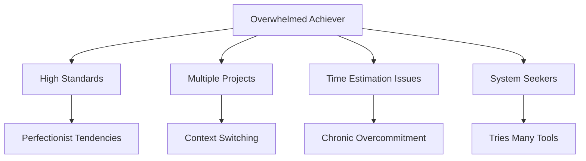
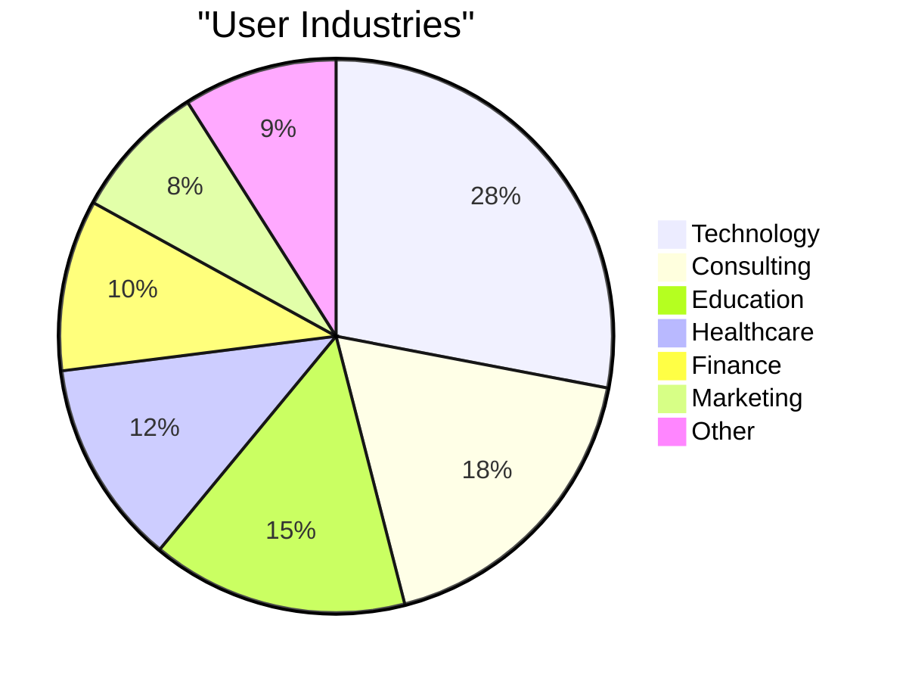
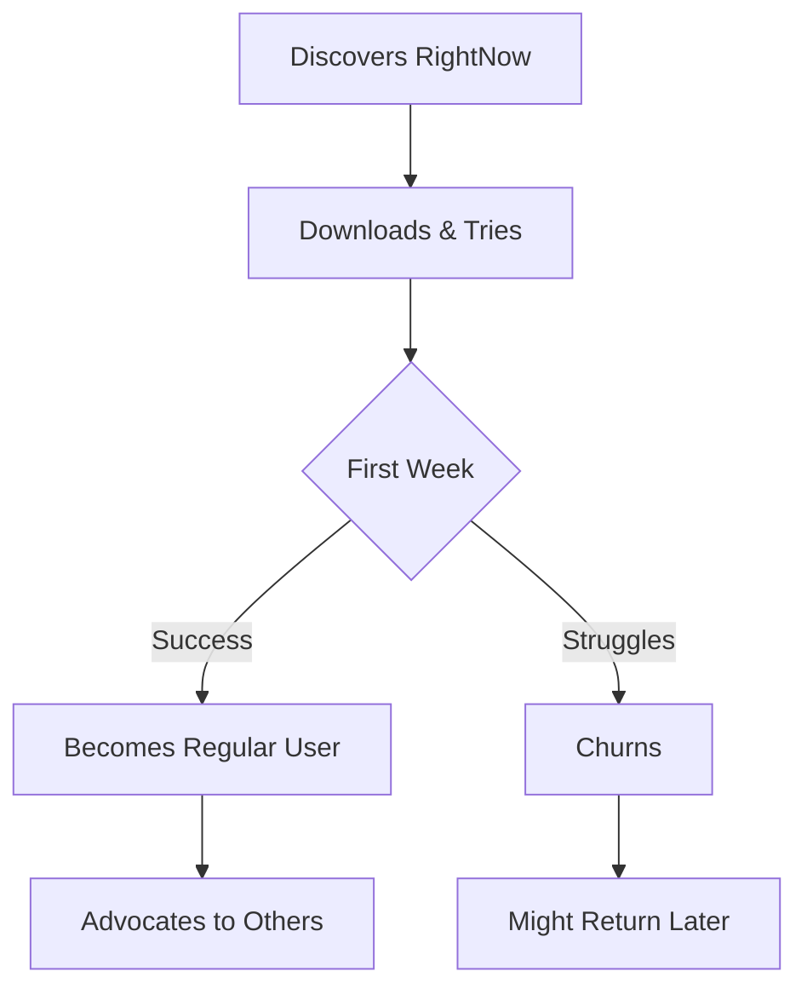

# Who RightNow is For: Target Audience & Real-World Use Cases

After months of user research, beta testing, and real-world feedback, I've discovered that RightNow resonates with a specific type of person. This isn't for everyone - and that's by design.

## The Core Problem We Solve

RightNow addresses **chronic overcommitment** - the tendency to plan more than we can actually accomplish. This affects different groups in unique ways.

## Primary Target Audience

### 🎯 The "Overwhelmed Achiever"

**Demographics:**
- Age: 25-45 years old
- Income: $50k-$120k annually
- Education: College-educated professionals
- Location: Urban/suburban, knowledge work environments

**Characteristics:**
- High standards for themselves
- Juggles multiple projects simultaneously
- Feels guilty about unfinished tasks
- Constantly underestimates time requirements
- Values systems and structure

## User Personas

### 👩‍💻 Sarah: The Product Manager

**Background:** 32, works at a mid-size tech company, manages 3 product teams

**Daily Challenges:**
- Balances strategic planning with tactical execution
- Constant stream of "quick questions" and interruptions
- Struggles to estimate meeting prep time
- Feels guilty leaving tasks undone

**How RightNow Helps:**
- Capacity bar prevents over-scheduling meetings
- Time tracking reveals true cost of context switching
- Analytics show patterns in her most productive hours
- Realistic daily goals reduce end-of-day stress

*"I used to schedule 12 hours of work in an 8-hour day. Now I see exactly what I can accomplish."*

### 👨‍💼 Marcus: The Freelance Consultant

**Background:** 28, independent consultant, 4 active clients

**Daily Challenges:**
- Billing accuracy requires precise time tracking
- Client work vs. business development balance
- Feast-or-famine workload management
- Difficulty saying no to new projects

**How RightNow Helps:**
- Built-in time tracking for billing accuracy
- Capacity management prevents overcommitment
- Task scheduling across multiple clients
- Visual workload planning for better client communication

*"I finally have data to show clients why their 'quick' requests take 2 hours."*

### 👩‍🎓 Emily: The Graduate Student

**Background:** 24, PhD candidate in psychology, teaches undergraduates

**Daily Challenges:**
- Balancing research, coursework, and teaching
- Long-term projects with vague deadlines
- Irregular schedule with deep work needs
- Procrastination on overwhelming tasks

**How RightNow Helps:**
- Breaks large research projects into manageable chunks
- Capacity planning around class schedules
- Grooming games make task refinement engaging
- Time tracking builds awareness of actual research time

*"The grooming games actually make me want to organize my backlog!"*

## Secondary Audiences

### 🏢 Small Business Owners

**Use Case:** Managing operations while growing the business

**Key Benefits:**
- Balances urgent vs. important tasks
- Prevents founder burnout through realistic planning
- Tracks time investment in different business areas
- Helps delegate by understanding true task duration

### 👨‍👩‍👧‍👦 Working Parents

**Use Case:** Juggling career and family responsibilities

**Key Benefits:**
- Realistic daily planning around family schedules
- Quick task capture during chaotic moments
- Flexible scheduling for unexpected family needs
- Guilt-free task rescheduling

### 🎓 Students & Researchers

**Use Case:** Managing complex, long-term projects

**Key Benefits:**
- Breaks overwhelming projects into daily actions
- Tracks research time for better estimation
- Balances multiple courses and deadlines
- Builds sustainable work habits

## What Makes Users Successful

### ✅ Ideal User Characteristics

1. **System Thinkers** - Enjoys processes and structure
2. **Growth Mindset** - Willing to learn from time tracking data
3. **Realistic Goals** - Wants to be more realistic, not just more productive
4. **Mobile-First** - Comfortable with smartphone-based tools
5. **Feedback Oriented** - Appreciates data-driven insights

### ❌ Poor Fit Indicators

1. **Perfectionist Paralysis** - Needs everything planned before starting
2. **Tool Hoppers** - Constantly switching between apps
3. **Micro-Managers** - Wants to track every minute of every day
4. **Reactive Workers** - Completely interrupt-driven, no planning
5. **Analog Preference** - Strongly prefers paper-based systems

## Geographic and Cultural Considerations

### 🌍 Global Reach

**Primary Markets:**
- United States (40% of users)
- Canada (15% of users)
- United Kingdom (12% of users)
- Australia (8% of users)
- Germany (6% of users)

**Cultural Adaptations:**
- Time formats (12h vs 24h)
- First day of week preferences
- Holiday and weekend settings
- Language localization (planned)

### 🏙️ Urban vs. Rural

**Urban Users (70%):**
- Longer commutes, mobile usage
- More meeting-heavy schedules
- Higher stress about time management
- Greater technology adoption

**Rural Users (30%):**
- More project-based work
- Flexible but demanding schedules
- Value simplicity and reliability
- Often small business owners

## Industry Breakdown

### Technology Professionals
- Software developers managing multiple projects
- Product managers coordinating teams
- UX designers balancing research and design work

### Consultants & Freelancers
- Need accurate time tracking for billing
- Juggle multiple clients simultaneously
- Struggle with feast-or-famine workloads

### Educators & Researchers
- Academic researchers with long-term projects
- Teachers balancing prep and grading
- Students managing complex course loads

## Age Demographics & Behavior

### 📊 Age Distribution

- **25-34 (45%)**: Early career professionals establishing systems
- **35-44 (35%)**: Mid-career with peak responsibility
- **45-54 (15%)**: Senior professionals seeking efficiency
- **18-24 (3%)**: Students and new graduates
- **55+ (2%)**: Career-focused individuals

### Generational Differences

**Millennials (25-40):**
- Comfortable with mobile-first tools
- Values work-life balance
- Appreciates gamification elements
- Expects immediate feedback

**Gen X (41-55):**
- Prefers functionality over aesthetics
- Values proven productivity methods
- Skeptical of new tools but loyal when convinced
- Appreciates comprehensive analytics

## Common User Journeys

### 🔄 The Typical Adoption Path

### Week 1: Trial Phase
- Sets up basic capacity
- Adds 10-15 tasks
- Experiments with time tracking
- **Key Success Factor**: Completing first day under capacity

### Week 2-4: Habit Formation
- Develops morning planning routine
- Starts trusting capacity estimates
- Begins using analytics
- **Key Success Factor**: Seeing pattern improvements

### Month 2+: Power User
- Uses advanced features (grooming, analytics)
- Customizes workflow
- Advocates to colleagues
- **Key Success Factor**: Measurable productivity gains

## User Feedback & Insights

### 💬 Common Praise

*"Finally, a to-do app that tells me when to stop adding tasks!"*

*"I love that it actually helps me be more realistic."*

*"The time tracking isn't annoying - it's actually helpful."*

*"I can see patterns I never noticed before."*

### 🎯 Feature Requests by Audience

**Product Managers:**
- Team collaboration features
- Project-level time tracking
- Integration with project management tools

**Freelancers:**
- Client time reporting
- Invoice generation
- Rate tracking

**Students:**
- Academic calendar integration
- Study session tracking
- Assignment deadline management

## Marketing Insights

### 🎯 Effective Messaging

**What Works:**
- "Stop overcommitting to your to-do list"
- "Finally, realistic daily planning"
- "See exactly what you can accomplish"
- "Time tracking that actually helps"

**What Doesn't Work:**
- "Get more done" (too generic)
- "Ultimate productivity system" (overwhelming)
- "Track every minute" (scary)
- "Replace all your tools" (threatening)

### 📱 Preferred Discovery Channels

1. **Word of mouth** (32%) - Personal recommendations
2. **App stores** (28%) - Organic discovery
3. **Social media** (22%) - Twitter, LinkedIn
4. **Productivity blogs** (18%) - Detailed reviews

## Conclusion: Building for Real People

RightNow succeeds because it solves a real problem for real people. We're not trying to be everything to everyone - we're trying to be perfect for the overwhelmed achiever who wants to work more sustainably.

The data shows that when we hit that sweet spot, users don't just use the app - they become advocates, sharing it with colleagues and friends who face similar challenges.

📱 **Try RightNow:**
- [RightNow App Development](/rightnow/)
- [Privacy Policy](/rightnow-privacy-policy/)
- [Delete Account](/rightnow-delete-account/)

---

*Next: [Core Features Walkthrough →](/blog/core-features-walkthrough)*

---

*Learn more: [RightNow App Development](/rightnow/) | [Technical Deep Dive](/blog/technical-deep-dive)*